# Active Directory Home Lab 
## Overview
This project simulates a basic enterprise IT environment using Active Directory.

I created a domain controller and client machine, configured users and security groups, set up shared folders with NTFS and share permissions.
---

## Lab Setup
- installed Windows Sever (Domain Controller)
- Created domain: HOMELAB.local
- Joined a windows client machine to the domain
--- 

## Users & Groups
- Created Users:
- jdoe (IT)
- hruser1 (HR)

- Created security groups:
- IT
- HR
- Added users to respective groups

Permissions were assigned using security groups instead of individual users to align with best practices.
---

## File Shares & Permissions

## Server Side
- Created folder: c:\Shared
- Created Subfolders:
   -IT
   -HR
- Shared folder as: "\\\WIN-2UUDQ76C8Q4\Shared"

## Permissions
- IT group -> Modify access to It folder
- HR group -> Modify access to HR folder
- HR group -> No access to IT folder
---

## Testing (Client Side)

## IT User (jdoe)
- Can access IT folder (read/write works)
- cannot access HR folder

## HR User
- Verified Access HR folder (read/write works)
- Cannot access It folder
---

## Group Policy

## Goal
Automatically map a network drive for IT users.

## Configuration (Server Side)
- Created GPO: Map IT Drive
- Navigated to:
- User configuration -> preferences -> Window Settings -> Drive Maps

- Mapped Drive:
-  Z: -> \\WIN-2UUDQ76c84Q\Shared\IT

## Targeting 
- Enabled item-level targeting
- Applied only to IT security group
---

## GPO Testing (Client Side)

## IT User (jdoe)
- Z: drive appears automatically
- Full access to IT folder
- No access to HR folder

## HR User (hruser1)
- Z: drive does NOT appear
- No access to IT resources
- Full access to HR folder
---

## Results
- Built working Active Directory environment
- Implemented role based NTFS and share permissions
- Creating and applying Group Policy Objects (GPOs)
- Trouble shooting domain, DNS, and permission issues
- Importance of role-based access control in It environments

##Screenshots

## Active Directory setup
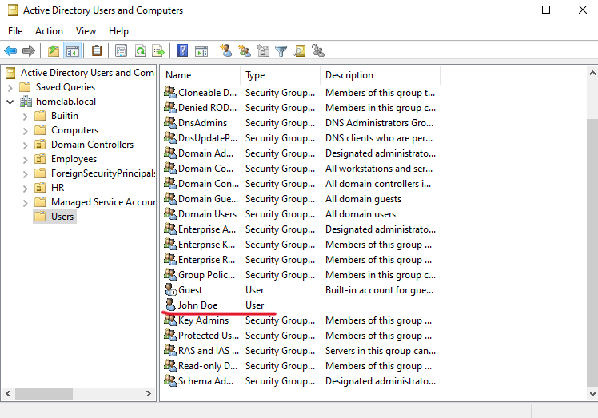
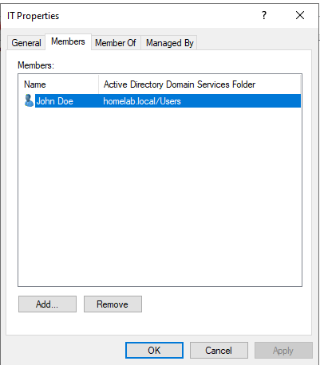
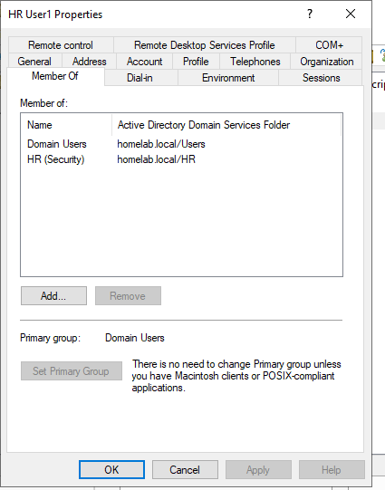

## Permissions configuration
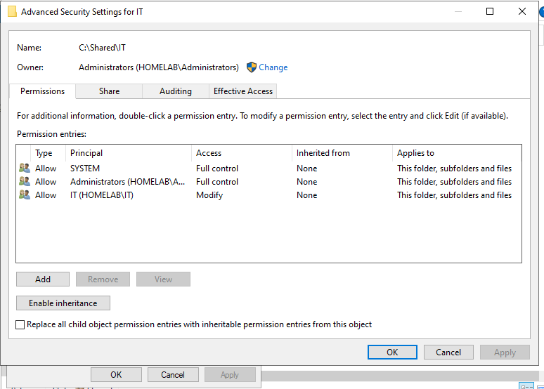
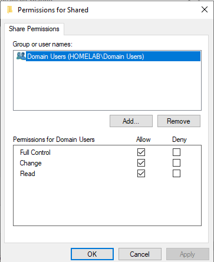

## Testing Access
## It user
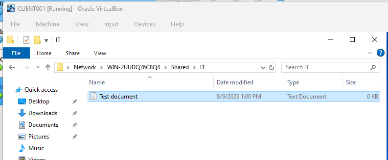
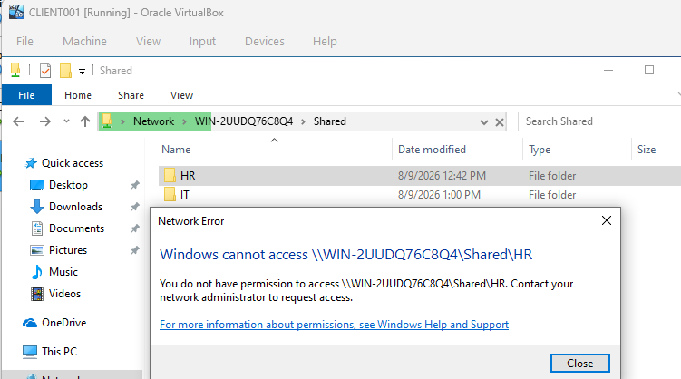

## HR user
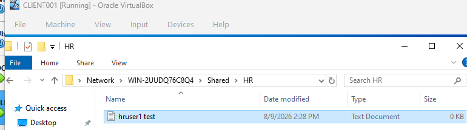
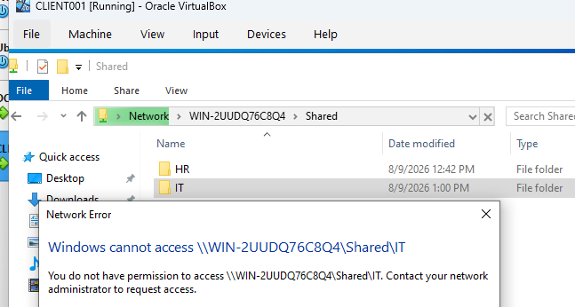

## GPO Targeting 
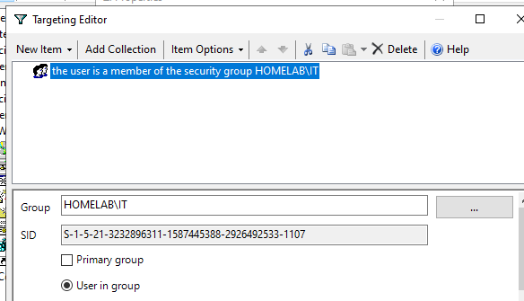
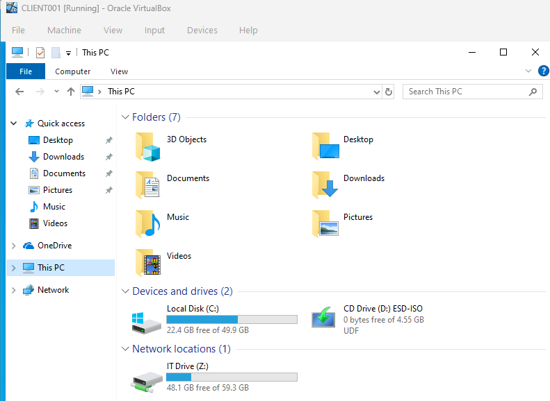
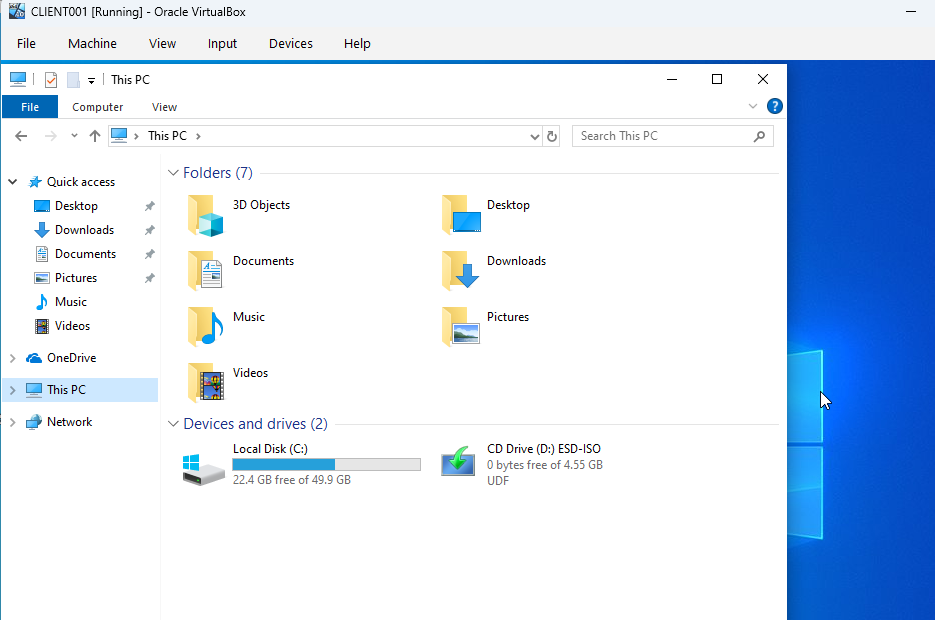
